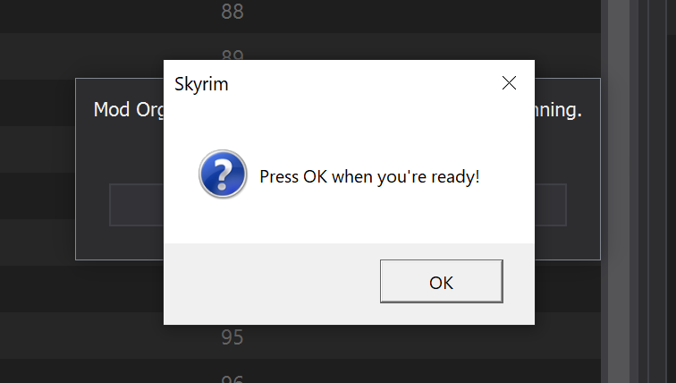

# Hol' up


## Description

Simple alternative to using a Debug build of SKSE64 skse64_loader to attach a debugger to SkyrimSE.exe _before Skyrim loads_.

> Note: if you can compile a debug build of SKSE64 that is more convenient (the game automatically starts when you attach a debugger) and can catch earlier initialization than this can.

Inspired by [Launch Blocker](https://www.nexusmods.com/skyrimspecialedition/mods/45542) but built using [CommonLibSSE-NG](https://github.com/CharmedBaryon/CommonLibSSE-NG) to support more modern versions of Skyrim.

It's simple.

Enable this plugin in MO2 and you'll get a prompt to continue.

This blocks all SKSE plugins from loading until you press OK.

> _Note: this is, itself, implemented as an SKSE plugin. It runs first because it is named `!!!SkyrimStartupMessageBox.dll` and SKSE loads plugins in alphebetical order based on .dll name._



## Do it yourself

If you want your own SKSE plugin to block using this message box before it loads, simply:

1. ```cpp
   #include <Windows.h>
   ```

2. ```cpp
   MessageBoxA(NULL, "Press OK when you're ready!", "Skyrim", MB_OK | MB_ICONQUESTION);
   ```

3. Attach your debugger

4. Press OK
